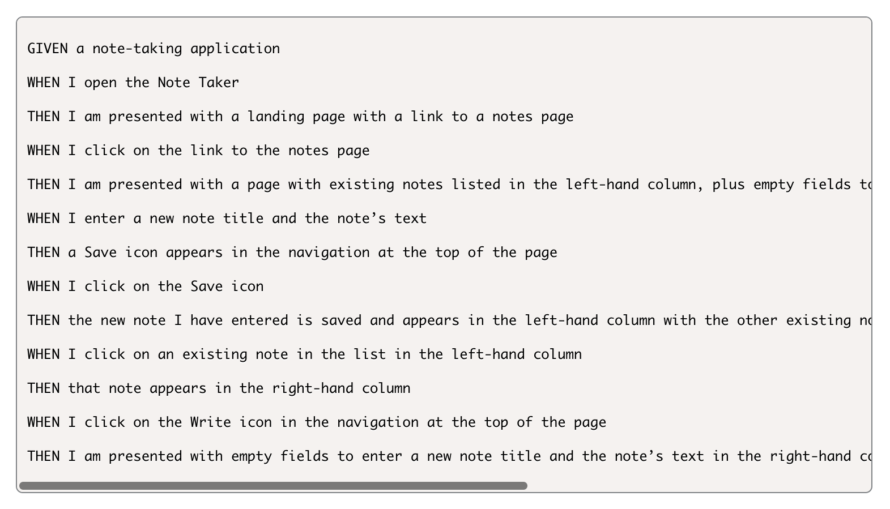
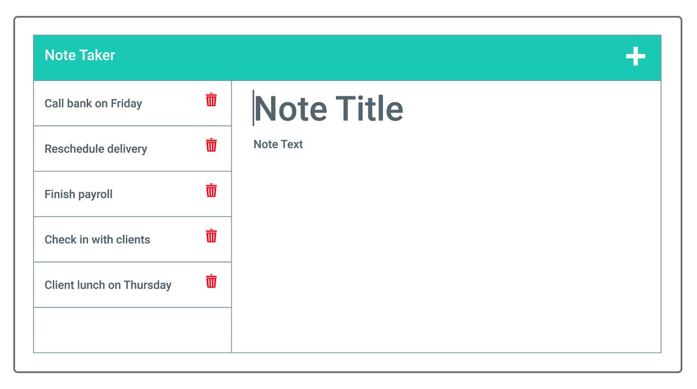

# Note Taker :memo:

This application was created for users be used to be able to write and save notes. This project uses an Express.js back, it saves and retrieves note data from a JSON file.


## **Steps to get started:**
```
- npm i
- node server.js
```

## **Application Acceptance Criteria:**


## **Mock Up:**


## **Technology used:**
```
- Javascript
- Node.js
- Express.js
- JSON
```

## **Steps for future development:**
```
- add more Javascript!
- successfully connect to Express backend 
```
